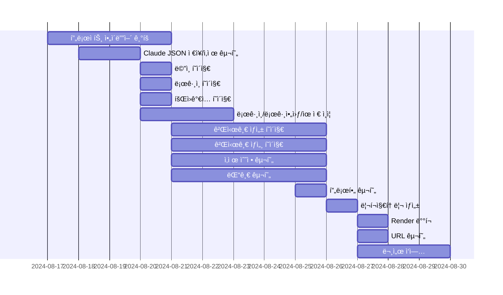

# Claude Export Data Backup Blog ( Unofficial )


Claudeì—ì„œ 'Export Data'ë¡œ ë‹¤ìš´ë¡œë“œë°›ì€ conversations.json 파ì¼ì„ SQLiteì— ì €ì¥í•˜ê³  Django를 통해 ì—´ëŒí•  수 ìˆëŠ” 기능과 블로그 ê¸°ëŠ¥ì„ ìœµí•©í•œ 웹 í˜ì´ì§€ì…니다.


## ë°°í¬ URL
[https://claude-export-data-backup-blog.onrender.com/](https://claude-export-data-backup-blog.onrender.com/)

- 테스트용 계정 (로그ì¸í•´ì•¼ ì‘성글 리스트와 메뉴가 í™”ë©´ì— ë‚˜ì˜µë‹ˆë‹¤)
  ```
  id : test
  pw : !test1234
  ```
  
### Render를 ì„ íƒí•œ ì´ìœ 

 1. 무료로 ì´ìš© 가능하고 ì´ìš© 기간 ì œí•œì´ ì—†ìŒ

 2. PostgresSQLì„ ë¬´ë£Œë¡œ ì´ìš© 가능


## WBS

```mermaid
gantt
  dateFormat  YYYY-MM-DD
	프로ì íŠ¸ ì•„ì´ë””ì–´ 기íš: 2024-08-17, 2024-08-21
	Claude JSON ì €ì¥/ì‚­ì œ 구현: 2024-08-18, 2024-08-20		
    	ë©”ì¸ í˜ì´ì§€: 2024-08-20, 2024-08-21
	ë¡œê·¸ì¸ í˜ì´ì§€: 2024-08-20, 2024-08-21
    	회ì›ê°€ì… í˜ì´ì§€: 2024-08-20, 2024-08-21
    	로그ì¸/로그아웃/유저 ì¸ì¦: 2024-08-20, 2024-08-23
    	게시글 ìƒì„± í˜ì´ì§€: 2024-08-21, 2024-08-26
   	게시글 ìƒì„¸ í˜ì´ì§€: 2024-08-21, 2024-08-26
    	삭제 수정 구현: 2024-08-21, 2024-08-26
	댓글 구현: 2024-08-21, 2024-08-26
    	프로필 구현: 2024-08-25, 2024-08-26
	리í¬ì§€í† ë¦¬ ìƒì„±: 2024-08-26, 2024-08-27
	Render ë°°í¬: 2024-08-27, 2024-08-28
	URL 구현: 2024-08-27, 2024-08-28
	문서 ì‘ì—…: 2024-08-27, 2024-08-30
```

## 구현한 기능

`<account>`

- 사용ìì˜ ë³„ëª…ì„ ì €ì¥
- 비밀번호 변경 기능
- 사용ì 프로필 조회/ì—…ë°ì´íŠ¸ 기능
- LoginRequiredMixinì„ ì‚¬ìš©í•˜ì—¬ 로그ì¸í•œ 사용ì만 ì ‘ê·¼ 가능
- 사용ì ê³„ì •ì´ ìƒì„±ë  ë•Œ 'default'ê·¸ë£¹ì— í¬í•¨ì‹œí‚¤ê³  기본 í”„ë¡œí•„ì„ ìë™ìœ¼ë¡œ ìƒì„±

`<blog>`

- 블로그 í¬ìŠ¤íŠ¸ì— 제목, ë‚´ìš©, ì‘성ì, ìƒì„± ë° ìˆ˜ì • 시간, 카테고리, ì´ë¯¸ì§€, 조회수 ë“±ì˜ ì •ë³´ë¥¼ í¬í•¨
- 댓글과 ëŒ€ëŒ“ê¸€ì„ ê³„ì¸µì  êµ¬ì¡°ë¡œ 구현
- í˜ì´ì§€ 기능
- 카테고리별 í•„í„°ë§
- 제목 검색 기능
- ì‘ì„±ì¼ ê¸°ì¤€ìœ¼ë¡œ 최신순, 오ë˜ëœ 순으로 í¬ìŠ¤íŠ¸ ì •ë ¬

`<claude>`

- Claude AIì™€ì˜ ëŒ€í™” 기ë¡ì„ ì €ì¥
- ì—…ë¡œë“œëœ ëŒ€í™” ê¸°ë¡ ëª©ë¡ì„ 표시
- í˜ì´ì§€ 기능
- UUID, 제목, ìƒì„± ë° ìˆ˜ì • 시간, 대화 메시지 ë“±ì˜ ì •ë³´ë¥¼ ê°€ë…성ìˆê²Œ htmlë¡œ ë Œë”ë§

### Django를 통해 구현한 ì´ìœ 

1. Claude JSONì˜ ë‚´ìš©ì„ DBì— ì €ì¥í•˜ê³  대화 ë‚´ì—­ì˜ uuid를 비êµí•˜ì—¬ upsert를 구현

2. Django는 sqliteê°€ 기본 ë‚´ì¥ë˜ì–´ ê°„í¸í•˜ê²Œ 사용할 수 ìˆì–´ì„œ 타 웹 프레ì„워í¬ì—ì„œ sqlite를 사용하는 경우보다 안정ì ìœ¼ë¡œ 사용 가능


<details>
<summary><h2> URL 구조 <h2></summary>

- blog

| blog | URL pattern               | Name                 | 기능              |
|------|---------------------------|----------------------|-------------------|
|      | ' '                       | home                 | ë©”ì¸ í˜ì´ì§€        |
|      | blog/                     | post_list            | 게시글 ëª©ë¡        | 
|      | blog/write/               | write_post           | 게시글 ì‘성        | 
|      | blog/<int:pk>/            | post_detail          | 게시글 ë””í…Œì¼ í˜ì´ì§€  |  
|      | blog/search/<str:tag>/    | search_posts         | 게시글 검색        | 
|      | blog/edit/<int:pk>/       | edit_post            | 게시글 수정        | 
|      | blog/delete/<int:pk>/     | delete_post          | 게시글 삭제        | 
|      | comment/<int:pk>/update/  | comment_update       | 댓글 수정          |
|      | comment/<int:pk>/delete/  | comment_delete       | 댓글 삭제          |

- claude

| claude | URL pattern      | Name        | 기능                            |
|--------|------------------|-------------|---------------------------------|
|        | ' '              | home        | claude í˜ì´ì§€ ì¸ë±ìŠ¤             |
|        | upload/          | upload_json | conversations.json 업로드        |
|        | list/            | list_entries| claude 대화 ëª©ë¡                 |  
|        | detail/<int:pk>/ | detail_entry| claude 대화 ëª©ë¡ ìƒì„¸ í˜ì´ì§€      | 
|        | delete-all/      | delete_all  | ì €ì¥ëœ claude 대화 ëª©ë¡ ì „ì²´ ì‚­ì œ |

- account

| account | URL pattern           | Name                 | 기능            |
|---------|-----------------------|----------------------|----------------|
|         | register/             | register             | íšŒì› ê°€ì…         |
|         | login/                | login                | ë¡œê·¸ì¸           | 
|         | password_change/      | password_change      | 비밀번호 변경      | 
|         | password_change/done/ | password_change_done | 비밀번호 변경 완료  | 
|         | profile/              | profile              | 프로필 í˜ì´ì§€      | 
|         | profile/update/       | profile_update       | 프로필 수정       |

</details>


<details>
<summary><h2> 프로ì íŠ¸ 구조 <h2></summary>
  <pre>
📦blog_project
 ┣ 📂account
 ┃ ┣ 📂templates
 ┃ ┃ ┗ 📂account
 ┃ ┃ ┃ ┣ 📜join.html
 ┃ ┃ ┃ ┣ 📜login.html
 ┃ ┃ ┃ ┣ 📜password_change_done.html
 ┃ ┃ ┃ ┣ 📜password_change.html
 ┃ ┃ ┃ ┣ 📜profile_update.html
 ┃ ┃ ┃ ┗ 📜profile.html
 ┃ ┣ 📜admin.py
 ┃ ┣ 📜apps.py
 ┃ ┣ 📜forms.py
 ┃ ┣ 📜models.py
 ┃ ┣ 📜tests.py
 ┃ ┣ 📜urls.py
 ┃ ┣ 📜views.py
 ┃ ┗ 📜__init__.py
 ┣ 📂blog
 ┃ ┣ 📂static
 ┃ ┃ ┗ 📂css
 ┃ ┃ ┃ ┣ 📜styles.css
 ┃ ┣ 📂templates
 ┃ ┃ ┗ 📂blog
 ┃ ┃ ┃ ┣ 📜base.html
 ┃ ┃ ┃ ┣ 📜comment_confirm_delete.html
 ┃ ┃ ┃ ┣ 📜comment_update.html
 ┃ ┃ ┃ ┣ 📜comments.html
 ┃ ┃ ┃ ┣ 📜detail.html
 ┃ ┃ ┃ ┣ 📜edit.html
 ┃ ┃ ┃ ┣ 📜index.html
 ┃ ┃ ┃ ┗ 📜list.html
 ┃ ┃ ┃ ┗ 📜write.html
 ┃ ┣ 📜admin.py
 ┃ ┣ 📜apps.py
 ┃ ┣ 📜forms.py
 ┃ ┣ 📜models.py
 ┃ ┣ 📜tests.py
 ┃ ┣ 📜urls.py
 ┃ ┣ 📜views.py
 ┃ ┗ 📜__init__.py
 ┣ 📂claude
 ┃ ┣ 📂templates
 ┃ ┃ ┗ 📂claude
 ┃ ┃ ┃ ┣ 📜detail_entry.html
 ┃ ┃ ┃ ┣ 📜home.html
 ┃ ┃ ┃ ┣ 📜list_entries.html
 ┃ ┃ ┃ ┣ 📜uploade_json.html
 ┃ ┣ 📜admin.py
 ┃ ┣ 📜apps.py
 ┃ ┣ 📜forms.py
 ┃ ┣ 📜models.py
 ┃ ┣ 📜tests.py
 ┃ ┣ 📜urls.py
 ┃ ┣ 📜views.py
 ┃ ┗ 📜__init__.py
 ┣ 📂config
 ┃ ┣ 📂settings
 ┃ ┃ ┃ ┣ 📜base.py
 ┃ ┃ ┃ ┣ 📜development.py
 ┃ ┃ ┃ ┣ 📜production.py
 ┃ ┣ 📜asgi.py
 ┃ ┣ 📜urls.py
 ┃ ┣ 📜wsgi.py
 ┃ ┗ 📜__init__.py
 ┣ 📂media
 ┣ 📜db.sqlite3
 ┣ 📜manage.py
 ┗ 📜requirements.txt
  </pre>
</details>

## ERD


auth_user í…Œì´ë¸”

- Djangoì˜ ê¸°ë³¸ ì¸ì¦ 시스템ì—ì„œ 제공하는 사용ì 정보를 ì €ì¥í•˜ëŠ” í…Œì´ë¸”ì…니다.

UserProfile í…Œì´ë¸”

- 사용ìì˜ ì¶”ê°€ì ì¸ 정보를 ì €ì¥í•©ë‹ˆë‹¤.

Post í…Œì´ë¸”

- 블로그 í¬ìŠ¤íŠ¸ì— 대한 정보를 ì €ì¥í•©ë‹ˆë‹¤.

Comment í…Œì´ë¸”

- ê° í¬ìŠ¤íŠ¸ì— 대한 ëŒ“ê¸€ì„ ì €ì¥í•©ë‹ˆë‹¤.

Category í…Œì´ë¸”

- 블로그 í¬ìŠ¤íŠ¸ì˜ 카테고리를 ì €ì¥í•©ë‹ˆë‹¤.

DataEntry í…Œì´ë¸”

- Claude 대화 ë‚´ì—­ ë°ì´í„° 백업과 ê´€ë ¨ëœ ì •ë³´ë¥¼ ì €ì¥í•©ë‹ˆë‹¤.


